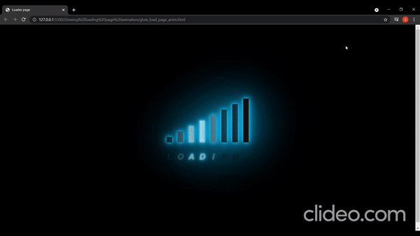

# Amazing-Css-Effects
 Some Astonishing CSS-Effects✨

### Demo 🎥
#### GitHub Pages website for this repository : https://arpit456jain.github.io/Amazing-Css-Effects/

### 💻 Tech Stack
### Front-End:
    
 

## 🚀 Quick Start :

### Before starting kindly please read the [Code of Conduct](/CODE_OF_CONDUCT.md)

## Contributions :
Check out our [Contributing Guildlines](/CONTRIBUTING.md)

 

 ## 📌Till Then 

 <h1 align=center> Project Admin ❤️ </h1>

<table>
  <tbody><tr>
 <td align="center"><a href="https://github.com/arpit456jain"> <b> Arpit Jain </b></a> <a href="https://github.com/arpit456jain/Amazing-Css-Efffects/commits?author=arpit456jain" title="Code">💻 </a></td> </a></td>

</tbody></table>

<h2 align=center> ✨ Contributors </h2>

Thanks go to these **Wonderful People** 👨🏻‍💻:      🚀 **Contributions** of any kind are welcome! 

<table>
	<tr>
		 <td>
  
		</td>
	</tr>
</table>

## 📘&nbsp; License

The Amazing CSS-effects is released under the under terms of the [MIT License](LICENSE).

<h1 align=center>Happy Coding 👨‍💻 </h1>

## 💬Join Our CES Community

Join - https://discord.gg/FVPvDUXfRR

show some ❤️&nbsp; by giving the star to this repo
